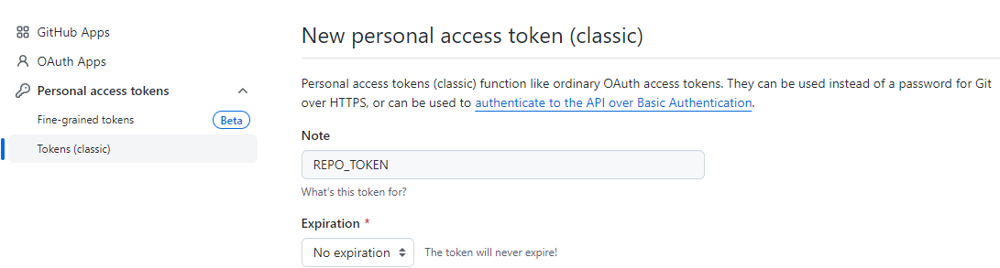

# secrets 添加步骤

1、右上角个人图标 -> `Settings` -> `Developer Settings` -> `Personal access tokens` -> `Tokens` -> `Generate new token`，填写相应名称，及选项，并复制生成的`token`；

 

2、在仓库`Settings` -> `Secrets and variables` -> `New repository serect`，`Name`填写`REPO_TOKEN`，`Secret`粘贴上步生成的`token`;

